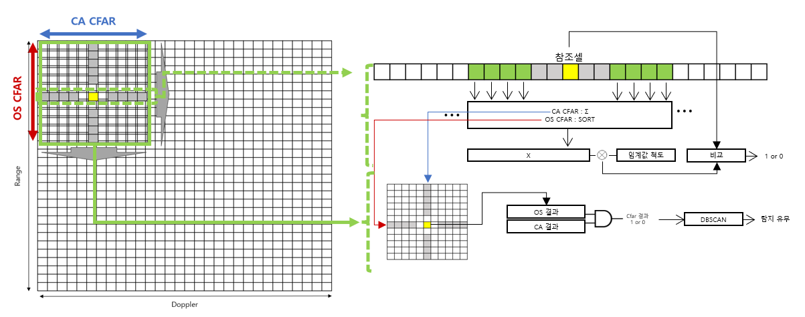

# Radar Single Object Detection
단일 객체 탐지

# Board
Ti - iwr1642

# Post-processing (matlab)

### json 파일 추출
- 설정한 파라미터가 담긴 파일로, 덤프 한 raw 데이터를 파라미터에 맞춰 reshape 과정을 거치기 위해 필요한 중요한 파일
- 데이터 덤프 후 setup -> load -> export 순으로 버튼 클릭
- 각 파일은 내가 저장할 파일 이름이 아닌 16xx 파일을 선택해두고 export 버튼을 누른 뒤에 생기는 창에서 내가 저장할 파일을 지정해주는 순서대로 진행

### rawDataReader.m 사용 방법 
- mmwavestudio 프로그램에서 추출한 json 파일 내용을 본인 컴퓨터 경로에 맞게 수정 필요
- JSONSampleFiles에 들어가서 setup.json파일이랑 mmwave.json파일을 PostProc에 복사
- 덤프한 raw data 인 “adc_data.bin’, “adc_raw_data0”를 PostProc에 복사
- setup.json파일 들어가서 경로 수정

이 파일을 열어 명령창에 rawDataReader('JSON setup File name','raw data file name', 'radarCube data file name', 'debug plot') 을 입력해 파일 실행<br>
ex) rawDataReader('1843_1107_1m.setup.json','1m_adc_raw_data', '1m_radarCube', 1)<br>
이렇게 생성된 'raw data file name.mat’ 파일과 , 'radarCube data file name.mat' 파일 두개를 가지고 신호처리 진행<br>

### object detection Sinal processing
mmwavestudio 프로그램으로 보드 연결해서 data dump - reshape 
.bin 이진 파일을 Ti 에서 제공하는 파일 rawDataReader.m 사용

1. load('pre_data_RAW.mat') : 덤프 받은 데이터 reshape -> 1d cfar input rangep-rofile processing -> 2d cfar input range-doppler processing
2. cfar_validate_1d : range-profile data 를 input 으로 OS, CA CFAR 구현 -> 두 알고리즘의 threshold 에는 차이가 있지만 같은 위치 detect 한것으로 검증
    (threshold 고정하기 위해 object detect num 사전에 제시하도록 후처리 신호처리 구현)
3. cfar_perform_2d : 1d cfar 에서 결정된 threshold를 사용하여 range-doppler에 적용
4. cfar_optimize_2d : 임계값을 샘플수 1/4 을 기준으로 적응형 임계값
```matlab
    while(true)
        if objectCnt_CA < (numrangeBins/3.0)
            break;
        end
    end

        
    while(true)
        if objectCnt_OS < (numrangeBins/3.0)
            break;
        end
    end

```
5. dbscan_integrate_2d : 최적화 한 탐지 결과에 dbscan 클러스터링 적용하여 뚜렷한 객체 탐지 가능
    (kmeans_test_2d 는 cfar_validate_1d 처럼 사전에 object detect num 을 제시한 경우 사용)

### detection point tracking Sinal processing


# Real-time-processing (C)
후처리에서 검증한 알고리즘을 보드의 타이밍과 메모리 고려하여 적용<br>
Ti에서 제공하는 Out of Box demo(OOB) 의 souce code 수정<br>
<br>
(***데모마다 포함하고 있는 헤더파일의 sdk 와 mathutils 버전 및 경로 확인)<br>
<br>
OOB 의 경우 탐지 후처리 알고리즘 적용 경로 아래와 같음<br>
C:\ti\mmwave_sdk_03_06_00_00-LTS\packages\ti\datapath\dpc\dpu\cfarcaproc\src<br>

### Siginal processing flow
CFAR - DBSCAN - PEAKGROUPING - Point Estimation

# CFAR 
셀평균(CA; cell averaging) CFAR는 참조 셀의 평균을 대푯값으로 결정<br>
순서통계(OS; ordered statistics)　CFAR는 정렬한 참조 셀 중 지정된 순서의 큰 값을 대푯값으로 결정<br>
<br>
2D CFAR - input : range doppler map<br>
(range profile data 를 input 으로 한 1D CFAR 각각 구현하여 검증 한 뒤 사진 구조로 적용)<br>
<br>
결정된 값에 임계값 척도를 곱해 테스트 셀과 비교해 타겟 유무를 판단<br>
이때 임계값 척도를 결정 짓는 것이 CFAR 알고리즘의 성능 결정<br>
<br>
거리 셀에서는 다수의 반사 신호가 고르게 분포하거나 클러터가 일정<br>
반면, 도플러 셀은 이동 물체의 주파수 변화에 따라 신호가 더 복잡하고 특정 속도에서의 간섭으로 인해 클러터가 고르지 않음<br>
때문에 거리 셀에는 셀평균, 도플러 셀에는 순서 통계 CFAR를 그림 1과 같이 적용<br>



거리-프로파일 CFAR에 사용된 임계값 척도를 그대로 사용하여 거리-도플러  CFAR를 계산하고 각 축에서 계산한 값이 모두 ‘탐지’일 때 해당 샘플을 타겟으로 결정하도록 하여 분명하게 탐지하는 알고리즘을 설계<br>

